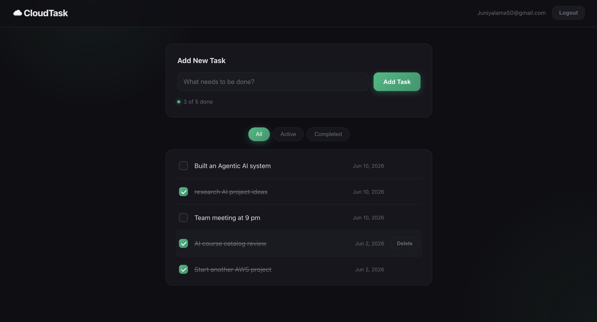
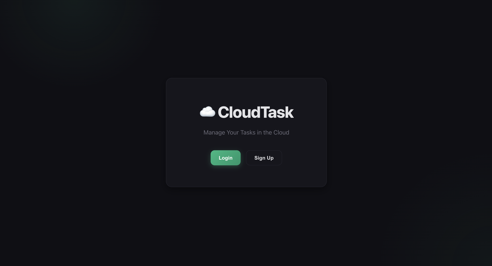

# ☁️ CloudTask

A full-stack (CRUD), serverless **to-do list web app** built on AWS. Users sign up, verify their email, log in, and manage personal tasks that persist in the cloud, each user only ever sees their own data.

I initially took the **AWS Cloud Practitioner Essential** course and built this to gain hands-on experience with cloud architectures, wiring together 7 core AWS services into a working, authenticated, serverless application.

---

## Architecture

```
              ┌──────────────────────────┐     ┌────────────────────────┐
   Browser ─▶ │ Amazon CloudFront (CDN)  │ ──▶ │ Amazon S3 (static web) │  HTML / CSS / JS
              │ global edge caching      │     │ (origin)               │
              └──────────────────────────┘     └────────────────────────┘
       │
       │  1. Auth (sign up / log in / verify)
       ▼
   ┌─────────────────────┐
   │  Amazon Cognito     │   User Pool — email/password + email verification
   │  (User Pool)        │   Issues JWT access tokens
   └─────────────────────┘
       │
       │  2. API calls with Bearer token
       ▼
   ┌─────────────────────┐      ┌──────────────────────────┐
   │  Amazon API Gateway │────▶ │  Cognito Authorizer       │  validates JWT
   │  (REST API /prod)   │      └──────────────────────────┘
   └─────────────────────┘
       │
       │  3. Proxy integration
       ▼
   ┌─────────────────────┐      ┌──────────────────────────┐
   │  AWS Lambda (Python)│────▶ │  Amazon DynamoDB          │
   │  create / get /     │      │  CloudTaskTable           │
   │  update / delete    │      │  PK: userId, SK: taskId   │
   └─────────────────────┘      └──────────────────────────┘
```

**Request flow:** The static frontend is served from an S3 origin and distributed globally through an Amazon CloudFront CDN, so users load the app from a low-latency edge location near them. The frontend authenticates the user against a Cognito User Pool and receives a JWT. Every task API request carries that token to API Gateway, where a Cognito authorizer validates it and injects the user's `sub` (user ID) into the request. The Lambda functions use that `sub` to scope all DynamoDB reads/writes to the logged-in user.

**Scheduled reminder (out of band):** An Amazon EventBridge schedule invokes a `DailyReminder` Lambda once a day. It scans DynamoDB for incomplete tasks and publishes a summary to an Amazon SNS topic, which emails the subscribed address. Setup steps are in [`docs/sns-reminder-setup.md`](docs/sns-reminder-setup.md).

---

## AWS Services Used

| Service | Role in the app |
|---|---|
| **Amazon S3** | Hosts the static frontend (HTML/CSS/JS) as the CDN origin |
| **Amazon CloudFront** | Global CDN — caches the app at edge locations for fast, low-latency delivery worldwide |
| **Amazon Cognito** | User sign-up, email verification, login, and JWT issuance |
| **Amazon API Gateway** | REST API with a Cognito authorizer protecting every route |
| **AWS Lambda** | Four Python functions implementing the task CRUD logic |
| **Amazon DynamoDB** | Stores tasks, partitioned per user (`userId` + `taskId`) |
| **Amazon SNS** | Sends the daily pending-tasks reminder email |
| **Amazon EventBridge** | Schedules the daily reminder Lambda |
| **IAM** | Scoped execution roles/policies (see [`docs/`](docs/)) |

---

## Features

- 🔐 **Secure auth** — email/password sign-up with email verification via Cognito
- 👤 **Per-user data isolation** — every task is keyed to the authenticated user's ID
- ✅ **Full task CRUD** — add, edit, complete, and delete tasks
- 🔎 **Filters** — view All / Active / Completed tasks
- 📊 **Live progress** — an "X of Y done" counter that updates as you work
- 📧 **Daily email reminder** — a scheduled SNS email summarizing pending tasks (see [`docs/sns-reminder-setup.md`](docs/sns-reminder-setup.md))

---

## API Endpoints

All routes require a valid Cognito JWT (`Authorization: Bearer <token>`).

| Method | Path | Lambda | Description |
|---|---|---|---|
| `GET` | `/tasks` | `get_tasks` | List the current user's tasks |
| `POST` | `/tasks` | `create_task` | Create a new task |
| `PUT` | `/tasks/{taskId}` | `update_task` | Update a task's title and/or completed state |
| `DELETE` | `/tasks/{taskId}` | `delete_task` | Delete a task |

---

## Project Structure

```
.
├── frontend/                 # Static web app (deployed to S3)
│   ├── index.html            # All views: landing, auth, app
│   ├── styles.css            # Dark + emerald theme
│   ├── app.js                # UI logic & rendering
│   ├── auth.js               # Cognito auth flows
│   ├── api.js                # API Gateway calls
│   └── config.js             # AWS resource IDs (region, pool, API URL)
├── lambda-functions/         # Python (boto3) Lambda handlers
│   ├── create_task.py
│   ├── get_tasks.py
│   ├── update_task.py
│   ├── delete_task.py
│   └── daily_reminder.py     # Scheduled SNS pending-tasks email
└── docs/                     # IAM policies, bucket policy & setup guides
    ├── lambda-execution-policy.json
    ├── daily-reminder-execution-policy.json
    ├── sns-reminder-setup.md
    └── s3-bucket-policy.json
```

---

## Tech Stack

- **Frontend:** Vanilla HTML, CSS, JavaScript (no framework, no build step)
- **Backend:** Python 3 + boto3 on AWS Lambda
- **Auth:** Amazon Cognito (User Pools)
- **Data:** Amazon DynamoDB
- **Hosting/CDN:** Amazon S3 + CloudFront
- **API:** Amazon API Gateway

---

## Running Locally

The frontend talks to the live AWS backend, so you only need a local static server:

```bash
cd frontend
python3 -m http.server 8000
```

Then open <http://localhost:8000>.

> **Note:** API Gateway must allow the `http://localhost:8000` origin (CORS) for task calls to succeed locally. Cognito login works from any origin.

---

## Deployment

The frontend is deployed by uploading the contents of `frontend/` to the S3 bucket that serves as the CloudFront origin, then creating a CloudFront invalidation (`/*`) so the edge caches pick up the new files. The Lambda functions are deployed to AWS Lambda and wired to API Gateway routes protected by the Cognito authorizer. Update `frontend/config.js` with your own `region`, `userPoolId`, `userPoolWebClientId`, and `apiEndpoint` to point the app at your AWS resources.

---

## Screenshots

### Task Dashboard


### Landing Page

